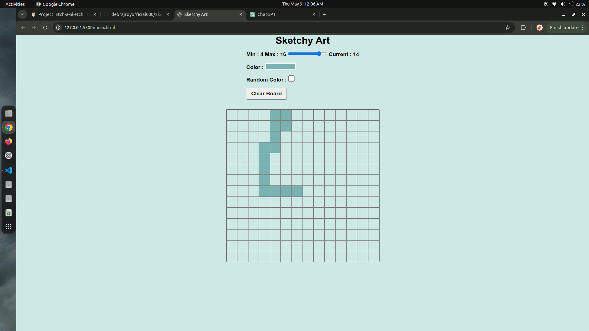

# Sketchy Art

Sketchy Art is a simple web application that allows users to draw on a board just by hovering pixels. Users can change the size of the board from 4x4 to 16x16 pixels and also change the background color of those pixels. Additionally, users can choose a specific color or use randomly generated colors to draw.

## Features

- Draw on a board by hovering over pixels.
- Change the size of the board from 4x4 to 16x16 pixels.
- Change the background color of the pixels.
- Choose a specific color or use randomly generated colors to draw.

## Installation

1. Clone the repository:

```bash

git clone https://github.com/debrajroyofficial000/Sketchy-Art.git

```

2. Navigate to the project directory:

3. Open `index.html` in your web browser.

## Usage

- Choose the size of the board using the dropdown menu.
- Click on the color picker to choose a specific color or click on the "Random Color" button to use randomly generated colors.
- Hover over the board to draw.

## Technologies Used

- HTML
- CSS
- JavaScript

## Demo

You can see a live demo of Sketchy Art [here]().

## Preview





